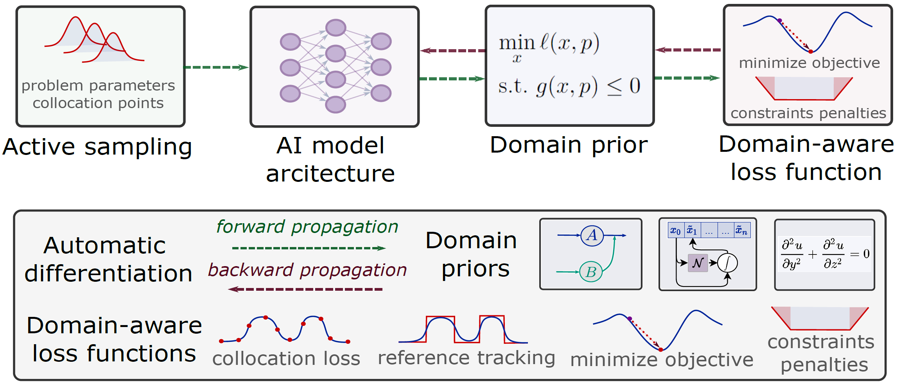

# Scientific Machine Learning for Modeling, Optimization, and Control

Official repository for the **Learning for Dynamics and Control (L4DC)** tutorial

> **Scientific Machine Learning for Modeling, Optimization, and Control**

**Tutorial website:** https://sciml-l4dc2026.github.io/SciML-L4DC2026/

The tutorial presents a unified perspective on **Scientific Machine Learning (SciML)** by showing that learning to model, learning to optimize, and learning to control can all be formulated as **differentiable programs** trained end-to-end with automatic differentiation.

<p align="center">

</p>

## Tutorial recordings

The complete tutorial is available on YouTube.

- **Part 1:** Introduction and Learning to Model (L2M)  
  https://www.youtube.com/watch?v=fabfvJc5p9M

- **Part 2:** Learning to Optimize (L2O) and Learning to Control (L2C)  
  https://www.youtube.com/watch?v=MERD-VpN4xw

## Tutorial contents

### Part I — Introduction

- Motivation for Scientific Machine Learning
- Differentiable programming
- A unified SciML abstraction
- Automatic differentiation and computational graphs

### Learning to Model (L2M)

- Constrained system identification
- Neural Ordinary Differential Equations (Neural ODEs)
- Physics-informed learning
- Structured learning with Gaussian Processes


### Learning to Optimize (L2O)

- Learning parametric solution maps
- Differentiable optimization layers
- Feasibility restoration
- Gradient-based constraint correction (DC3)

### Learning to Control (L2C)

- Differentiable Predictive Control (DPC)
- Learning explicit control policies
- Closed-loop differentiation
- Neural operator control of PDEs


## Hands-on Notebooks

The hands-on examples accompanying the tutorial are organized into three complementary Scientific Machine Learning paradigms. All notebooks can be run directly in **Google Colab** without any local installation.

---

### Learning to Model (L2M)

**Example 1 — Neural Ordinary Differential Equations (Neural ODEs)**

<a href="https://colab.research.google.com/github/SciML-L4DC2026/SciML-L4DC2026/blob/main/notebooks/L2M/Example_1_NODE/Example_1_NODE.ipynb" target="_blank">
  
</a>

Learn differentiable system identification with Neural ODEs, automatic differentiation through ODE solvers, and physics-informed modeling.

---

**Example 2 — Gaussian Process Port-Hamiltonian Systems**

<a href="https://colab.research.google.com/github/SciML-L4DC2026/SciML-L4DC2026/blob/main/notebooks/L2M/Example_2_GPPHS/GP_PHS.ipynb" target="_blank">
  
</a>

Learn structured system identification by combining Gaussian Processes with Port-Hamiltonian system representations.

---

### Learning to Optimize (L2O)

**Example 1 — Learning Parametric Solution Maps with DC3**

<a href="https://colab.research.google.com/github/SciML-L4DC2026/SciML-L4DC2026/blob/main/notebooks/L2O/Example_1_DC3/Example_1_DC3.ipynb" target="_blank">
  
</a>

Learn neural solution operators for constrained optimization together with differentiable feasibility restoration using DC3.

---

**Example 2 — HUANet**

<a href="https://colab.research.google.com/github/SciML-L4DC2026/SciML-L4DC2026/blob/main/notebooks/L2O/Example_2_HUANet/HUANet_entropy.ipynb" target="_blank">
  
</a>

Learn differentiable optimization with entropy-regularized assignment problems and neural optimization layers.

---

### Learning to Control (L2C)

**Example 1 — Differentiable Predictive Control for Nonlinear ODEs**

<a href="https://colab.research.google.com/github/SciML-L4DC2026/SciML-L4DC2026/blob/main/notebooks/L2C/Example_1_DPC_ODE/Example_1_DPC_ODE.ipynb" target="_blank">
  
</a>

Learn explicit neural control policies by differentiating through nonlinear closed-loop dynamical systems and predictive control objectives.

---

**Example 2 — Neural Operator Predictive Control for PDEs**

<a href="https://colab.research.google.com/github/SciML-L4DC2026/SciML-L4DC2026/blob/main/notebooks/L2C/Example_2_DPC_PDE/Example_2_DPC_PDE.ipynb" target="_blank">
  
</a>

Learn scalable control of partial differential equations using neural operators, differentiable physics, and operator learning for real-time decision making.


## Repository structure

```text
.
├── assets/          Website assets
├── notebooks/       Hands-on tutorial notebooks
│   ├── L2M/
│   ├── L2O/
│   └── L2C/
├── slides/          Tutorial slides
├── index.html       Tutorial website
└── README.md
```

## Organizers

- Thomas Beckers — Vanderbilt University
- Truong X. Nghiem — University of Central Florida
- Ján Drgoňa — Johns Hopkins University

## Acknowledgments

This tutorial was developed for the Learning for Dynamics and Control (L4DC) conference.

The examples are built using **PyTorch**, **JAX**, and **NeuroMANCER**.

We gratefully acknowledge the support of JHU's Ralph O'Connor Sustainable Energy Institute (ROSEI), and U.S. Department of Energy (DOE) Advanced Scientific Computing Research (ASCR) program via the LEADS institute.

## Citation

If you found these materials useful, please cite the tutorial or associated papers.


```bibtex
@misc{beckers2026sciml,
  title        = {Scientific Machine Learning for Modeling, Optimization, and Control},
  author       = {Beckers, Thomas and Nghiem, Truong X. and Drgo{\v{n}}a, J{\'a}n},
  year         = {2026},
  howpublished = {Learning for Dynamics and Control (L4DC) Tutorial},
  note         = {Tutorial website: https://sciml-l4dc2026.github.io/SciML-L4DC2026/},
  url          = {https://sciml-l4dc2026.github.io/SciML-L4DC2026/}
}
```
